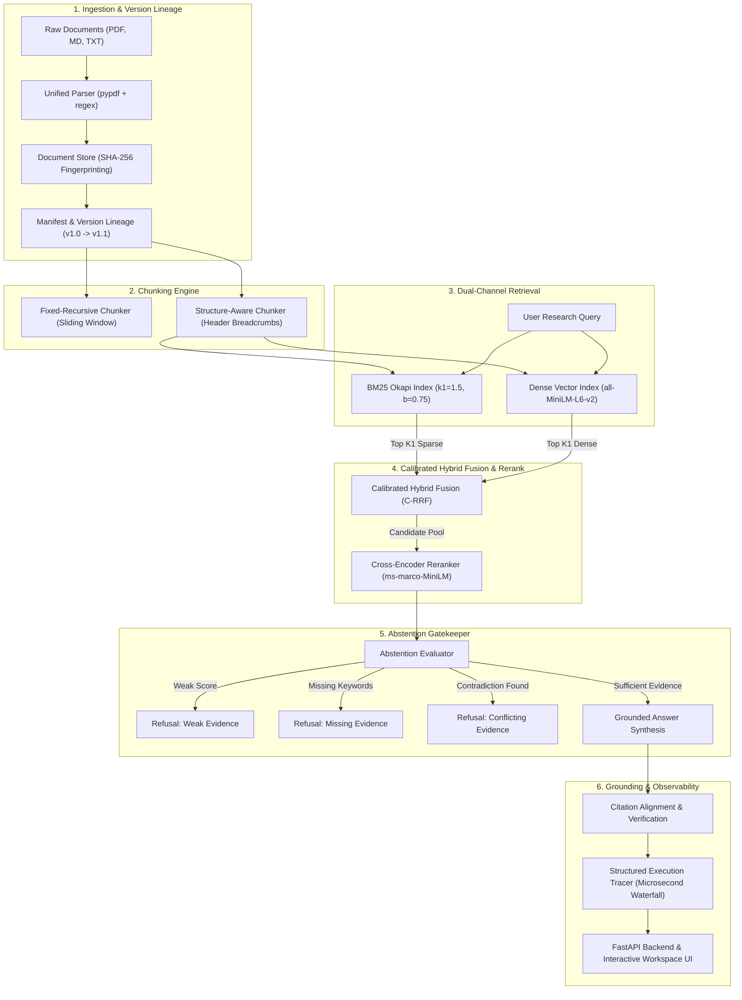
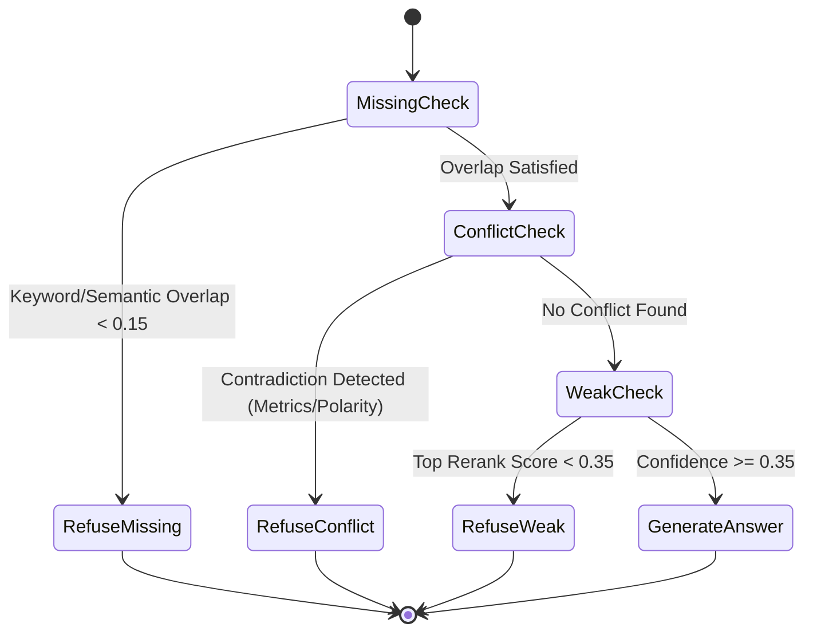

# EvidenceBench System Architecture & Technical Design

This document describes the architectural specifications, mathematical formulations, and engineering design decisions behind EvidenceBench.

---

## 1. System Overview & Component Diagram

---

## 2. Ingestion & Deduplication Pipeline

### 2.1 SHA-256 Document Fingerprinting
Every ingested document is hashed using SHA-256 over its raw binary content:
$$\text{Hash}(D) = \text{SHA256}(\text{bytes}(D))$$

The `DocumentStore` maintains a content-addressable index:
1. **Duplicate Detection**: If $\text{Hash}(D) \in \text{Catalog}$, ingestion is skipped (`DUPLICATE_IGNORED`), preventing redundant vectorization and BM25 index bloat.
2. **Version Lineage**: If $\text{Filename}(D)$ exists in catalog but $\text{Hash}(D)$ differs, a new document version is minted:
   $$\text{Version}(D_{new}) = \text{Version}(D_{prev}) + 1$$
   The active index version tag (e.g. `v1.0`) is updated, and previous versions are archived as superseded.

### 2.2 Structural PDF & Markdown Parsing
- **PDF Extraction**: Extracted page-by-page via `pypdf`. Headings matching numbered section regexes (`1. Executive Summary`, `2. Storage Layer`) are detected across the assembled document text. Page boundary offsets are maintained so that every section and character offset maps accurately to its physical page number.
- **Markdown Extraction**: Evaluates markdown header trees (`# H1`, `## H2`, `### H3`), creating an inheritance hierarchy:
  $$\text{HierarchyPath} = [\text{H1}, \text{H2}, \text{H3}]$$
  Section spans run contiguously from one header match to the next.

---

## 3. Chunking Strategies

EvidenceBench implements two distinct chunking strategies to study the trade-off between uniform stride length and semantic structure:

### 3.1 Strategy A: Fixed-Size Recursive Character Chunker
- **Chunk Size:** 500 characters
- **Overlap:** 100 characters
- **Separators:** `["\n\n", "\n", ". ", "; ", ", ", " "]`
- **Characteristics:** Provides uniform text length across chunks, but may slice across numbered lists, tables, or compound sentences.

### 3.2 Strategy B: Structure-Aware Hierarchical Chunker (Proprietary Component)
- **Max Chunk Size:** 800 characters
- **Min Chunk Size:** 150 characters
- **Behavior:** Segments strictly along document section boundaries. Paragraphs within the same section are grouped up to `max_chunk_size` without cutting through table rows or sentences.
- **Context Prefix Injection:** Prepend structural provenance breadcrumbs to the raw chunk text:
  $$\text{Chunk}_{\text{repr}} = \left[\text{Filename} \mid \S \;\text{H1} > \text{H2} \mid \text{Page } P\right] + \text{"\n"} + \text{Text}$$
  This provides the dense embedding model and BM25 with high-level topical context even for short factual statements.

---

## 4. Dual-Channel Retrieval & Calibrated Hybrid Fusion (C-RRF)

### 4.1 Keyword Retrieval (Okapi BM25)
First-principles implementation of Robertson-Spärck Jones Okapi BM25:
$$\text{Score}_{\text{BM25}}(D, Q) = \sum_{q \in Q} \text{IDF}(q) \cdot \frac{f(q, D) \cdot (k_1 + 1)}{f(q, D) + k_1 \cdot \left(1 - b + b \cdot \frac{|D|}{\text{avgdl}}\right)}$$
$$\text{IDF}(q) = \ln \left( \frac{N - n(q) + 0.5}{n(q) + 0.5} + 1.0 \right)$$
where $k_1 = 1.5, b = 0.75$, with regex tokenization and English stopword filtering.

### 4.2 Dense Vector Retrieval
Uses `SentenceTransformer('all-MiniLM-L6-v2')` generating 384-dimensional $L_2$-normalized embeddings:
$$\mathbf{v}_d = \frac{\mathbf{e}_d}{\|\mathbf{e}_d\|_2}, \quad \mathbf{v}_q = \frac{\mathbf{e}_q}{\|\mathbf{e}_q\|_2}$$
Cosine similarity is calculated via fast dot-product matrix multiplication:
$$\text{Sim}(q, d) = \mathbf{v}_q \cdot \mathbf{v}_d^T$$

### 4.3 Calibrated Reciprocal Rank Fusion (C-RRF) (Proprietary Component)
Standard RRF discards score magnitude. If dense retrieval is 99% confident, standard RRF treats rank 1 vs 2 identically regardless of whether the score was 0.95 vs 0.30.

EvidenceBench formulates **Calibrated Reciprocal Rank Fusion (C-RRF)**:

1. **Rank Reciprocal Term:**
   $$\text{Score}_{\text{RRF}}(d) = \frac{w_{\text{dense}}}{k + r_{\text{dense}}(d)} + \frac{w_{\text{bm25}}}{k + r_{\text{bm25}}(d)}$$
   where $k = 60$, $w_{\text{dense}} = 0.6$, $w_{\text{bm25}} = 0.4$.

2. **Min-Max Score Normalization Term:**
   $$\hat{S}_m(d) = \frac{S_m(d) - \min(S_m)}{\max(S_m) - \min(S_m) + \epsilon}$$
   $$\text{Score}_{\text{norm}}(d) = w_{\text{dense}} \cdot \hat{S}_{\text{dense}}(d) + w_{\text{bm25}} \cdot \hat{S}_{\text{bm25}}(d)$$

3. **Composite Calibrated Score:**
   $$\text{Score}_{\text{hybrid}}(d) = \beta \cdot \frac{\text{Score}_{\text{RRF}}(d)}{\text{MaxRRF}} + (1 - \beta) \cdot \text{Score}_{\text{norm}}(d)$$
   where $\beta = 0.70$ balances rank invariance with raw score intensity.

---

## 5. Cross-Encoder Reranking & Exposition

Top $K_1 = 20$ candidates from Hybrid Fusion are evaluated by a deep cross-encoder (`cross-encoder/ms-marco-MiniLM-L-6-v2`):
$$z(q, d) = \text{CrossEncoder}(q, d)$$
Logits are converted to calibrated probabilities via sigmoid:
$$p(q, d) = \sigma(z) = \frac{1}{1 + e^{-z}}$$

The reranker exposes:
- Raw logit $z$
- Normalized probability $p$
- Top margin $\Delta_1 = p_1 - p_2$
- Rank transitions ($\text{pre\_rank} \to \text{post\_rank}$) in the API and debug view.

---

## 6. The Abstention Gatekeeper (Multi-Criteria Refusal)

The system refuses to answer when available evidence violates any of three foundational criteria:

1. **Missing Evidence:**
   $$\text{OverlapRatio}(Q, \{C\}) = \frac{|\text{Keywords}(Q) \cap \text{Tokens}(\{C\})|}{|\text{Keywords}(Q)|}$$
   If $\text{OverlapRatio} < 0.15$, return `ABSTAIN: MISSING_EVIDENCE`.
2. **Conflicting Evidence:**
   Evaluates cross-document candidate pairs $(C_i, C_j)$ where $\text{Doc}(C_i) \neq \text{Doc}(C_j)$:
   - **Numerical Discrepancy:** Identifies shared metric concepts (e.g. `reduction target`, `EBITDA`, `budget`) where reported numbers differ ($N_i \neq N_j$).
   - **Polarity Flip:** Identifies antonym pairs (`approved` vs `rejected`, `active` vs `deprecated`) in top candidates discussing the same entity.
   If detected, return `ABSTAIN: CONFLICTING_EVIDENCE` with source references.
3. **Weak Evidence:**
   If $p_1 < \tau_{\text{weak}} = 0.35$, return `ABSTAIN: WEAK_EVIDENCE`.

---

## 7. Citation Alignment & Verification Engine

Generated answers contain passage-level citations:
`[Doc: cloud_architecture_2025.pdf, p. 1, § 1. Executive Summary | chunk: chk_struct_cloud__000]`

The **CitationAligner** verifies every citation before output:
1. Sentence extraction preserves square citation brackets and abbreviations.
2. For claim sentence $S$ and cited chunk $C$, computes factual token containment:
   $$\text{AlignmentScore}(S, C) = \frac{|\text{Entities}(S) \cap \text{Tokens}(C)|}{|\text{Entities}(S)|}$$
3. Marks citation as faithful if $\text{AlignmentScore} \ge 0.30$.
4. Computes system-wide **Citation Precision** and **Citation Coverage**.

---

## 8. Microsecond Execution Tracing Schema

Every query generates an immutable `ExecutionTrace`:
- `trace_id`: UUID
- `timestamp`: ISO-8601 UTC
- `index_version`: string
- `pipeline_mode`: enum
- `stages`: Array of `StageTrace` (Stage name, duration in ms, input summary, output summary)
- `candidate_scores`: Complete table of candidate IDs, doc names, page, dense rank/score, BM25 rank/score, RRF score, rerank logit/probability.
- `abstention_decision`: Decision, confidence score, rationale, conflict IDs.
- `citations`: Verified spans, source breadcrumbs, alignment scores.
