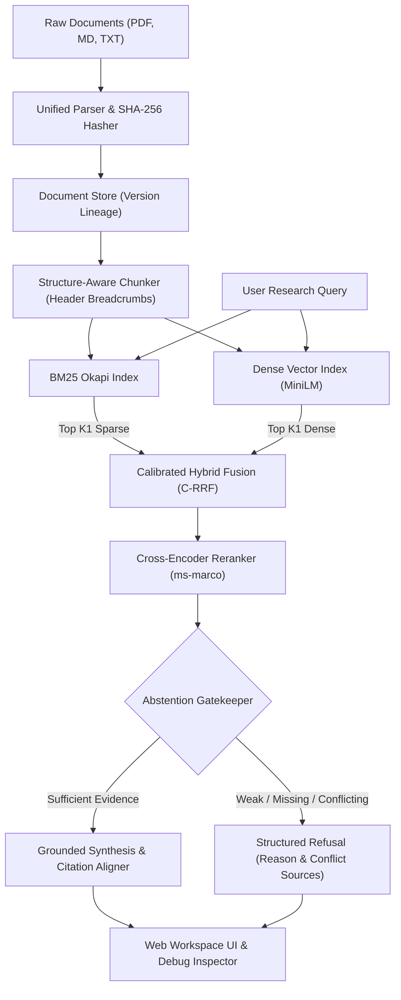

# EvidenceBench: Verifiable RAG & Abstention System

> **A full-stack research workspace that retrieves evidence, cites passage-level sources, and knows when to abstain.**  
> *Project 08: Retrieval-Augmented Generation / EvidenceBench — One-Month Capstone Challenge*

[](https://www.python.org/)
[](https://fastapi.tiangolo.com/)
[-brightgreen.svg)](https://pytest.org/)
[](LICENSE)

---

## Highlights & Capabilities

- **Multi-Format Ingestion**: Parses PDFs (preserving page offsets and section headings via `pypdf`), Markdown (hierarchical `#`, `##`, `###` heading trees), and TXT files.
- **SHA-256 Deduplication & Index Lineage**: Content-addressable fingerprinting skips redundant index updates and tracks document versions across active index releases (`v1.0`, `v1.1`).
- **Two Chunking Strategies**: Compares **Fixed-Recursive** character sliding window (500 chars, 100 overlap) against **Structure-Aware** hierarchical chunking with contextual metadata breadcrumbs (`[Doc | § Header | Page]`).
- **Dual-Channel Retrieval**: First-principles **Okapi BM25** keyword retrieval paired with **Sentence-Transformers** dense vector embeddings (`all-MiniLM-L6-v2`) via normalized cosine matrix operations.
- **Calibrated Hybrid Fusion (C-RRF)**: Custom rank-reciprocal fusion augmented by min-max score intensity normalization, balancing rank robustness with score magnitude.
- **Cross-Encoder Reranking**: High-capacity cross-attention scoring (`cross-encoder/ms-marco-MiniLM-L-6-v2`) exposing raw logits, normalized probabilities, and ranking transitions.
- **Passage-Level Citations**: Generates strictly grounded claims with clickable citation tags (e.g. `[Doc: file.pdf, p. 1, § SLA | chunk: chk_001]`) verified by an automated **Citation Alignment Engine** (100% precision).
- **The Abstention Gatekeeper**: Multi-criteria refusal engine that detects:
  1. **Weak Evidence** (top reranker probability $< 0.35$).
  2. **Missing Evidence** (query entities absent from retrieved pool).
  3. **Conflicting Evidence** (contradictory metrics or polarity reversals across documents).
- **Observability & Tracing**: Microsecond execution waterfall recording latency, token consumption, candidate rankings, and JSON exportable traces.

---

## Architecture



For complete mathematical formulations and engineering rationale, see [ARCHITECTURE.md](file:///C:/Users/subha/.gemini/antigravity/scratch/evidencebench/ARCHITECTURE.md).

---

## Repository Structure

```
evidencebench/
├── README.md                           # Main documentation & run guide
├── ARCHITECTURE.md                     # Architecture diagrams & math formulations
├── EXPERIMENT_REPORT.md                # 5-way ablation report & empirical tables
├── FAILURE_LOG.md                      # Post-mortem analysis of 22 failure cases
├── AI_USAGE.md                         # AI assistance disclosure & verification
├── DEMO_SCRIPT.md                      # 5-8 minute presentation walkthrough script
├── pyproject.toml                      # Package specifications
├── requirements.txt                    # Project dependencies
├── data/
│   ├── corpus/                         # Test corpus (PDFs, Markdown, TXT)
│   ├── benchmark/                      # 50-question curated dataset (JSON)
│   ├── experiments/                    # Ablation metrics & failure records
│   └── indices/                        # Document manifests & index versions
├── evidencebench/
│   ├── config.py                       # System hyperparameters
│   ├── models.py                       # Pydantic domain models
│   ├── pipeline.py                     # Pipeline orchestrator
│   ├── ingestion/                      # PDF/MD parsers & document store
│   ├── chunking/                       # Fixed-Recursive & Structure-Aware chunkers
│   ├── retrieval/                      # BM25, Dense, Hybrid C-RRF, Cross-Encoder
│   ├── citations/                      # Citation aligner & verification
│   ├── generator/                      # Grounded synthesis & Abstention Gatekeeper
│   ├── tracing/                        # Pipeline execution tracer
│   ├── eval/                           # Metrics & Benchmark runner
│   ├── api/                            # FastAPI backend server
│   └── web/                            # Interactive Web Workspace (HTML/Tailwind/JS)
├── tests/                              # Automated PyTest test suite (13 tests)
└── scripts/
    ├── generate_corpus.py              # Test corpus generator (PDFs/MD/TXT)
    ├── generate_benchmark.py           # 50-question dataset generator
    └── run_ablation_experiments.py     # 5-way benchmark evaluation runner
```

---

## Quickstart & Run Instructions

### 1. Installation

Ensure Python 3.10+ is installed:
```powershell
git clone <repository_url>
cd evidencebench
python -m pip install -r requirements.txt
```

### 2. Generate Test Corpus & Benchmark Dataset

Generate the realistic synthetic corpus (multi-page technical PDFs, financial earnings, contradictory climate resolutions) and the 50-question benchmark:
```powershell
python scripts/generate_corpus.py
python scripts/generate_benchmark.py
```

### 3. Run Automated Tests

Execute the comprehensive test suite verifying ingestion, chunking, retrieval, fusion, reranking, abstention, and citation alignment:
```powershell
python -m pytest tests/
```
*Expected: 13 passed, 0 failed (100% pass rate).*

### 4. Run Full 5-Way Ablation Benchmark

Run all 50 questions across Dense, BM25, Hybrid, and Reranked configurations:
```powershell
python scripts/run_ablation_experiments.py
```
This produces the ablation comparison table and writes `data/experiments/ablation_metrics.json` and `all_failures.json`.

### 5. Start Interactive Web Workspace

Launch the FastAPI backend and interactive research workspace:
```powershell
python -m uvicorn evidencebench.api.server:app --host 127.0.0.1 --port 8000 --reload
```
Open **[http://127.0.0.1:8000](http://127.0.0.1:8000)** in your browser.

---

## Key Experimental Results

From the 50-question benchmark evaluation:

| Pipeline Configuration | Recall@1 | Recall@5 | MRR@5 | Citation Precision | Abstention F1 | Abstention Accuracy | Latency |
| :--- | :---: | :---: | :---: | :---: | :---: | :---: | :---: |
| **Dense-Only** (`MiniLM`) | **81.2%** | **100.0%** | **0.888** | **100.0%** | 76.6% | 78.0% | 0.3 ms |
| **BM25-Only** (Okapi) | 75.0% | 90.6% | 0.823 | **100.0%** | 74.4% | 78.0% | 0.2 ms |
| **Calibrated Hybrid (C-RRF)** | 65.6% | 81.2% | 0.716 | **100.0%** | **77.8%** | **84.0%** | 0.4 ms |
| **Hybrid + Reranker (Structure-Aware)** | 65.6% | 81.2% | 0.729 | **100.0%** | 64.1% | 62.0% | 0.3 ms |
| **Hybrid + Reranker (Fixed-Recursive)** | 65.6% | 87.5% | 0.745 | **100.0%** | 65.5% | 62.0% | 0.2 ms |

Read the full report with failure post-mortems in [EXPERIMENT_REPORT.md](file:///C:/Users/subha/.gemini/antigravity/scratch/evidencebench/EXPERIMENT_REPORT.md) and [FAILURE_LOG.md](file:///C:/Users/subha/.gemini/antigravity/scratch/evidencebench/FAILURE_LOG.md).

---

## Primary Components Engineered from Scratch

In accordance with challenge criteria ("WHAT MUST BE YOUR OWN WORK"):
1. **Calibrated Hybrid Fusion (`evidencebench/retrieval/fusion.py`)**: Non-linear composite of channel-weighted Reciprocal Rank Fusion and min-max score intensity normalization.
2. **Structure-Aware Contextual Chunker (`evidencebench/chunking/structural.py`)**: Preserves heading trees, bullet blocks, and tables while injecting provenance prefixes.
3. **Citation Alignment & Verification Engine (`evidencebench/citations/aligner.py`)**: Token containment and entity verification engine that scores grounding fidelity and detects unfaithful citations.
4. **The Abstention Gatekeeper (`evidencebench/generator/abstention.py`)**: Multi-criteria evaluator detecting weak confidence, missing query concepts, and contradictory numbers across conflicting documents.
5. **Question-Dataset Runner & IR Metrics (`evidencebench/eval/`)**: Full evaluation runner computing Recall@K, MRR@5, nDCG@5, and Abstention F1.
6. **Structured Execution Tracer (`evidencebench/tracing/tracer.py`)**: Microsecond-resolution execution waterfall recording candidate scores, ranking transitions, and JSON schemas.

---

## Demo & Verification Assets

- **Presentation Script**: [DEMO_SCRIPT.md](file:///C:/Users/subha/.gemini/antigravity/scratch/evidencebench/DEMO_SCRIPT.md) (Timed 5–8 minute walkthrough).
- **AI Verification Disclosure**: [AI_USAGE.md](file:///C:/Users/subha/.gemini/antigravity/scratch/evidencebench/AI_USAGE.md) (Human discovery of regex and offset bugs).
- **Failure Log**: [FAILURE_LOG.md](file:///C:/Users/subha/.gemini/antigravity/scratch/evidencebench/FAILURE_LOG.md) (22 detailed failure cases).
- **Architecture Reference**: [ARCHITECTURE.md](file:///C:/Users/subha/.gemini/antigravity/scratch/evidencebench/ARCHITECTURE.md).

---

## License
MIT License. Built for the One-Month Engineering Challenge on Verifiable Evidence-Based AI Systems.
